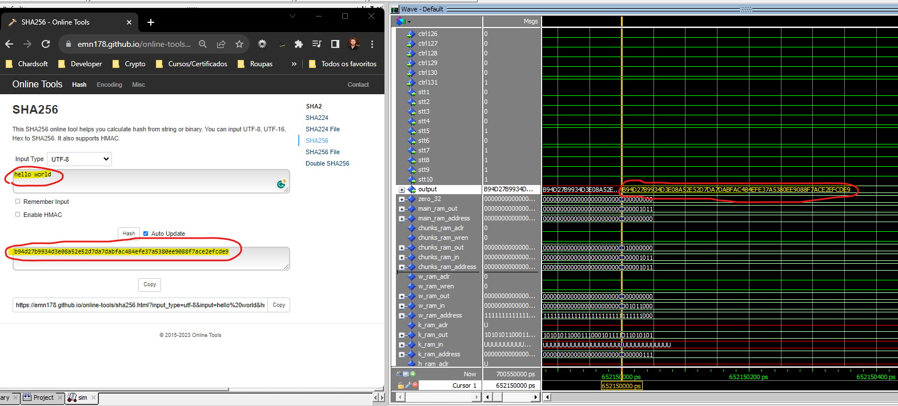
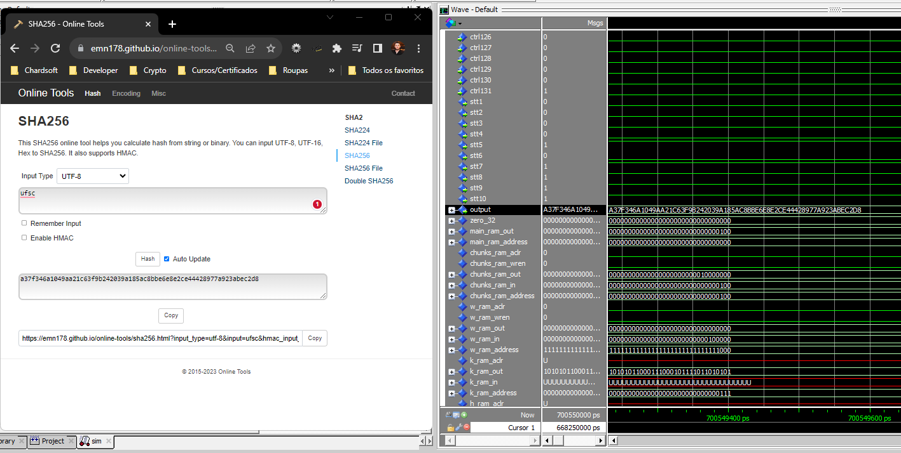
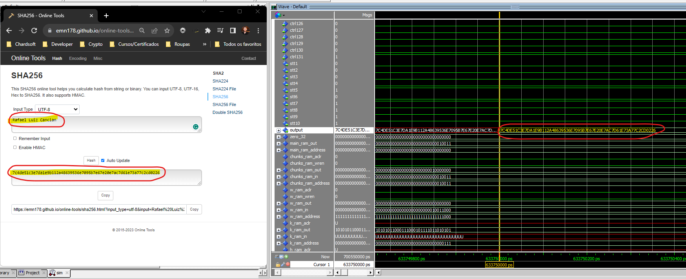

# SHA256-hardware-device

# SHA256 Implementation in C and VHDL

This repository contains two separate implementations of the Secure Hash Algorithm 256-bit (SHA256). One implementation is written in the C programming language for software applications, and the other is described in VHDL for hardware integrations (e.g., FPGA or ASIC).

## SHA256 Overview

SHA256 is a cryptographic hash function that produces a fixed-size 256-bit (32-byte) hash. It is one of the functions in the SHA-2 family designed by the National Security Agency (NSA) and is a widely used algorithm in various security applications and protocols, including TLS and SSL, PGP, SSH, and IPsec.

## C Implementation

The C implementation is designed to be portable and efficient, suitable for integration into various applications that require reliable cryptographic hashing.

### Features

- High portability across different platforms
- Comprehensive set of unit tests ensuring algorithm correctness






### Usage

1. Clone the repository.
2. Navigate to the `C` directory.
3. Compile the C code using the provided Makefile.
4. Run the executable with the data you want to hash.

### Building

#### VHDL
To synthesize the SHA256 implementation in VHDL:

1. Open your hardware synthesis tool (Intel Quartus ONLY).
2. Create a new project and add the VHDL files from the VHDL directory.
3. Set up your synthesis, implementation, and programming settings according to your hardware target.
4. Run the synthesis process.
5. If desired, run a simulation to verify functional correctness.
6. Generate a bitstream or netlist for your hardware.

#### C
```bash
$ git clone <repository-url>
$ cd <repository-name>/software
$ make run
